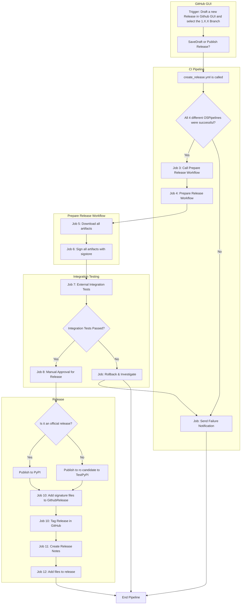

<!--
Copyright (c) ONNX Project Contributors

SPDX-License-Identifier: Apache-2.0
-->

# ONNX Releases

The ONNX project, going forward, will plan to release roughly on a four month cadence. We follow the [Semver](https://semver.org/) versioning approach and will make decisions as a community on a release by release basis on whether to do a major or minor release.

## Preparation
* Determine version (X.Y.Z) for the new release
    * Discuss in Slack channel for Releases (https://lfaifoundation.slack.com/archives/C018VGGJUGK)
    * For (v.X.Y.Z), if release is to be 1.16.0,
        * X=1, Y=16, Z=0
        * The new branch will be `rel-1.16.0`
            * Branch protections rules are automatically applied to branches following this format.
        * The new tag will be `v1.16.0`
* Create new page for the release in [Release logistics wiki](https://github.com/onnx/onnx/wiki)

## Create Release Branch
* In `main` branch, before creating the release branch:
    1.  Bump the `LAST_RELEASE_VERSION` in [version.h](/onnx/common/version.h).
        * Set to X.Y.Z, which is same as the release branch you are currently creating.
        * After the release branch is cut, `VERSION_NUMBER` in `main` will be increased to the next future version.
    1.  Make sure the release version, IR version, ai.onnx opset version, ai.onnx.ml opset version, and ai.onnx.training opset version are correct for the new release in [ONNX proto files](/onnx/onnx.in.proto), [Versioning.md](Versioning.md), [schema.h](/onnx/defs/schema.h), [helper.py](/onnx/helper.py), and [helper_test.py](/onnx/test/helper_test.py).

* Create a release branch
    1. Click "New branch" from [branches](https://github.com/onnx/onnx/branches) and choose `main` as Source.
    1. Make sure all tests pass on the new branch.

* After cutting the release branch:
    1. Create PR to set [VERSION_NUMBER](/VERSION_NUMBER) file in `main` to the next future release, `X.Y+1.0`.
    1. Create PR to set `VERSION_NUMBER` file in the new release's branch to `X.Y.Zrc1`.
        * For example the first release candidate for 1.16.0 would be `1.16.0rc1`
    1. Bump opset version for ai.onnx domain in `onnx/defs/operator_sets.h` and `onnx/defs/schema.h` for use by future operator additions and changes.
        * For example, this [demo PR](https://github.com/onnx/onnx/pull/6001).

** Source Distribution (TODO: this has to also made by a step of the release pipeline **
1. Make sure all the git submodules are updated
    * ``git submodule update --init``
1. Make sure the git checkout is clean –
    * Run ``git clean -nxd``
        * Make sure that none of the auto-generated header files such as the following are present.
            * onnx/onnx-operators.pb.cc
            * onnx/onnx-operator.pb.h
            * onnx/onnx.pb.cc
            * onnx/onnx.pb.h
        * If they are present run ``git clean -ixd`` and remove those files from your local branch
1. Generate the source distribution file: ``python -m build --sdist``
    * Run `pip install build` if you don't already have the `build` package.
1. Upload source distribution file to TestPyPI: ``twine upload --repository testpypi --verbose -u <YOUR_TESTPYPI_USER> dist/*``
    * Notes:
        * A current owner of the ONNX project will need to give you access to the project before you can push files.
        * The project name and version built into the files.
1. Confirm TestPyPI package can be installed:
    * Wheel install: `pip uninstall -y onnx && pip install -i https://test.pypi.org/simple/ --pre onnx`
       * Assumes pre-built while is available for your environment, if not a source install will start.
    * Source install: `pip uninstall -y onnx && pip install -i https://test.pypi.org/simple --no-binary onnx --pre onnx`

## Package verification
**Test ONNX itself**
* Test the PyPI package installation with different combinations of various Python versions, Protobuf versions and platforms.
  * After installing the TestPyPI package, run `pytest` in the release branch.
  * Python versions : Applicable python versions for the release.
  * Protobuf versions : Latest protobuf version at the time of the release + protobuf version used for previous release

**Partner Validation**

 * Test with onnxruntime package:
     * Run the test script from [test_with_ort.py](/onnx/test/test_with_ort.py) with installed onnxruntime package.
        * The scripts tests ONNX functions like `load`, `checker.check_model`, and `shape_inference.infer_shapes`, with onnxruntime functions like `InferenceSession` and `InferenceSession.run` on certain example ONNX model.

 * Open Issues for external repos:
     * Create GitHub issues in converters' repos to provide them the package links and oppuruntity to test the release before it goes public.
        * https://github.com/microsoft/onnxruntime
            * Example: https://github.com/microsoft/onnxruntime/issues/19783
            * Note: [How_To_Update_ONNX_Dev_Notes](https://github.com/microsoft/onnxruntime/blob/main/docs/How_To_Update_ONNX_Dev_Notes.md) exists in their repo documenting how to pull in new ONNX releases.
        * https://github.com/pytorch/pytorch
            * Example: https://github.com/pytorch/pytorch/issues/121258
        * https://github.com/onnx/tensorflow-onnx
            * Example: https://github.com/onnx/tensorflow-onnx/issues/2310
        * https://github.com/onnx/onnx-tensorrt
            * Example: https://github.com/onnx/onnx-tensorrt/issues/956
        * https://github.com/onnx/sklearn-onnx
            * Example: https://github.com/onnx/sklearn-onnx/issues/1079
        * https://github.com/microsoft/onnxconverter-common
            * Example: https://github.com/microsoft/onnxconverter-common/issues/277
        * https://github.com/onnx/onnxmltools
            * Example: https://github.com/onnx/onnxmltools/issues/685
        * https://github.com/Quantco/spox
        * https://github.com/conda-forge/onnx-feedstock

 * If issues are found, the bugs are to be fixed in the onnx `main` branch and then cherry-picked into the release branch.
    * Follow up with reporter to ensure issues are resolved (and validated in a new rc) or deferred to a new release.

# Official Release-Workflow

Validation steps must be completed before this point! This is the point of new return.

* git tags should not be changed once published
* Once pushed to PyPI there is no way to update the release. A new release must be made instead

## Set final version number
* Create PR to remove "`rcX`" suffix from `VERSION_NUMBER` file in the new release's branch.

## Create release tag
* [Draft a release](https://github.com/onnx/onnx/releases/new) based on the release branch:
    * DO NOT click `Publish release` until you are sure no more changes are needed.
        * Use `Save Draft` if need to save and update more later.
        * Publishing will create the new git tag
    * Tag: See top of [Preparation](#Preparation) for tag to create.
    * Target: The release branch that was just cut
    * Previous tag: Select the previous release.
    * Write:
        * Use [previous releases](https://github.com/onnx/onnx/releases) as a template
        * Use information from [Release logistics wiki](https://github.com/onnx/onnx/wiki) which should have been created prior to branch cut.
        * Add any additional commits that merged into the release in since wiki was written.
    * .tar.gz and .zip will be auto-generated after publishing the release.

* a) The pipelines for different os variants start to run and save the wheels for all OS Version. Only if all all 4 release pipelines were successful the next preparation step is started
* b) During the preparation step of the pipeline, the artifacts are cryptographically signed with sigstore for supply chain security reasons
* c) The step is paused (until the deployment was reviewed and the defined reviewer approve the release). At this step the whl could also be downloaded for offline-testing. We use the feature of [deployment environment](https://docs.github.com/en/actions/deployment/targeting-different-environments/using-environments-for-deployment) here.
* d) After the The final step is about 
    i) publishing the wheels and tar.gz files to official pypi 
    ii) adding the signing information to the official github release
    

## Upload to Official PyPI
### NOTES:
* Once the packages are uploaded to PyPI, **you cannot overwrite it on the same PyPI instance**.
  * Please make sure everything is good on TestPyPI before uploading to PyPI**
* PyPI has separate logins, passwords, and API tokens from TestPyPI but the process is the same. An ONNX PyPI owner will need to grant access, etc.

Follow the **Wheels** and **Source Distribution** steps in [Upload release candidate toTestPyPI](#Upload-release-candidate-to-TestPyPI) above with the following changes:
* Create a new API token of onnx scope for uploading onnx wheel in your [PyPI account](https://pypi.org/manage/account) (**API tokens** section).
    * Remove the created token after pushing the wheels and source for the release.
* When uploading, remove `--repository testpypi` from twine commands.
* When verifying upload, remove `-i https://test.pypi.org/simple/` and `--pre` from pip commands.

## After PyPI Release

**Announce**
* Slack:
    * Post in the [onnx-release](https://lfaifoundation.slack.com/archives/C018VGGJUGK) and [onnx-general](https://lfaifoundation.slack.com/archives/C016UBNDBL2) channels.
* Notify ONNX partners via email lists:
    * onnxdiscussions@service.microsoft.com
    * onnxconverterteam@service.microsoft.com
    * onnxruntimeteam@microsoft.com
* [ONNX News](https://onnx.ai/news.html) Post
    * Update [news.json](https://github.com/onnx/onnx.github.io/blob/main/js/news.json), see [example news.json PR](https://github.com/onnx/onnx.github.io/pull/197)

**Update conda-forge package with the new ONNX version**

Conda builds of ONNX are done via [conda-forge/onnx-feedstock](https://github.com/conda-forge/onnx-feedstock), which runs infrastructure for building packages and uploading them to conda-forge.

* A PR should be created automatically by `regro-cf-autotick-bot` a few hours after the release is available at https://github.com/onnx/onnx/releases.

* If the automatic PR has build failures:
    1. Make a personal fork of conda-forge/onnx-feedstock
    1. Create a personal branch based on the automated PR branch
    1. Resolve the build issue
    1. Submit a replacement PR based on your branch

    * Example: https://github.com/conda-forge/onnx-feedstock/pull/116

* If the automatic PR is not created, you need to submit a PR manually
    * Example: https://github.com/conda-forge/onnx-feedstock/pull/50
    * Note: Use the sha256 hash (`sha256sum onnx-X.Y.Z.tar.gz`) of the release's tar.gz file from https://github.com/onnx/onnx/releases.

**Merge into main branch**
* If urgent changes were made directly into the release branch, merge the release branch back into main branch.
* If all PRs merged into the release branch (after it was cut) were cherry-picks from main, the merge PR will show as empty and this step is not needed.

**Remove old onnx-weekly packages on PyPI**
* Remove all [onnx-weekly packages](https://pypi.org/project/onnx-weekly/#history) from PyPI for the just released version to save space.
* Steps:
    * Go to [PyPI onnx-weekly/releases](https://pypi.org/manage/project/onnx-weekly/releases/)
        * This is a separate project than the onnx releases so you may need to request access from an owner
    * Click target package -> Options -> Delete.
d