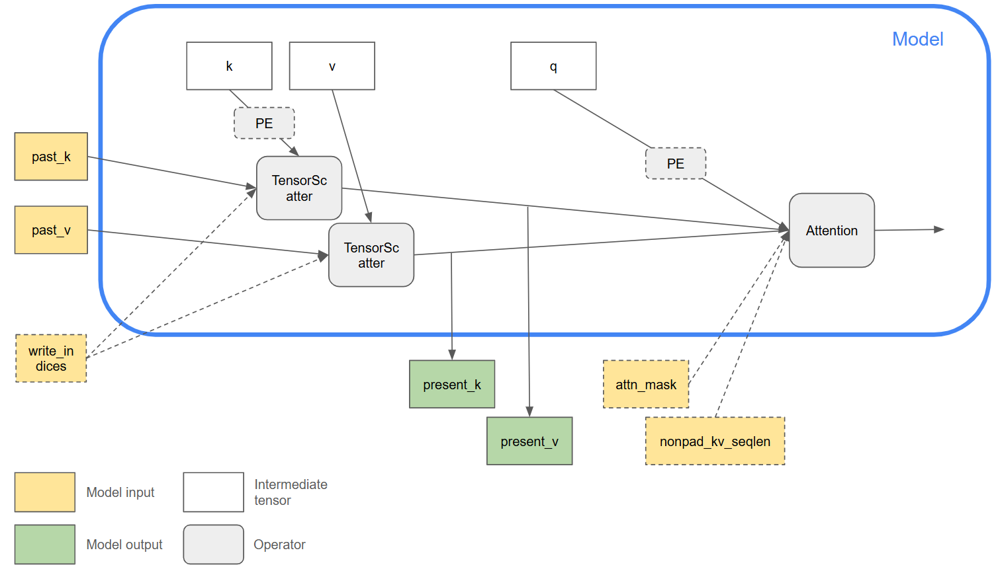

<!--
Copyright (c) ONNX Project Contributors

SPDX-License-Identifier: Apache-2.0
-->

(onnx-detail-kvcache)=

# In-place KV Cache for Attention

KV caching in attention-based models refers to a mechanism for storing previously computed Key and Value tensors during autoregressive generation. In decoder-only transformers, each new token must attend to all previous tokens using the attention mechanism. Normally, this would require recomputing the Key and Value projections for every prior token at each time step, which is inefficient. Instead, the KV cache stores these projections after they are first computed, allowing the model to reuse them for future tokens without recomputation. This significantly speeds up the generation process.

Updating the KV cache in place means writing new Key and Value tensors directly into pre-allocated memory at the index corresponding to the current position in the sequence. This has several advantages: it avoids repeated memory allocation or copying, reducing computational overhead; it also allows better performance on hardware accelerators by enabling the use of fused kernels and reducing memory bandwidth usage. In-place updates are essential for achieving high throughput and low latency during inference, particularly for large language models deployed in real-time applications.

ONNX opset-24 has introduced new features to facilitate the representation of in-place KV cache updates. This diagram shows an example use case:

- The `K` and `V` inputs to the `Attention` op contain the entire KV cache tensors with the sequence length dimension being max_sequence_length, hence the size of these inputs do not grow between autoregressive iterations. For this reason an optional `nonpad_kv_seqlen` input can be used to indicate the number of valid (non-padding) tokens in each sample to skip unnecessary computations.
- The logic for KV cache update is separated out of the `Attention` op. The `TensorScatter` op can be used to update the cache tensors, where the incoming key and value tokens for the current iteration are scattered into the cache tensors according to `write_indices`.
- As an optimization, the backend is free to alias the past and present key/value tensors to avoid duplicating the cache tensors and achieve in-place update. For this optimization to be valid, the backend will need to ensure that the input to `TensorScatter` is not subsequently reused by other ops. Only then is it safe to reuse the memory allocated to the `past_k/v` input of the op for the `present_k/v` output.
- The same computational graph can be used for both the prefill and decode stages of the autoregressive model.

As a reminder, the ONNX representation is still a functional representation, with ops that are pure functions. The graph layout described above is a useful common pattern to express in-place KV cache update, and the input/output aliasing is entirely up to backend implementations.
