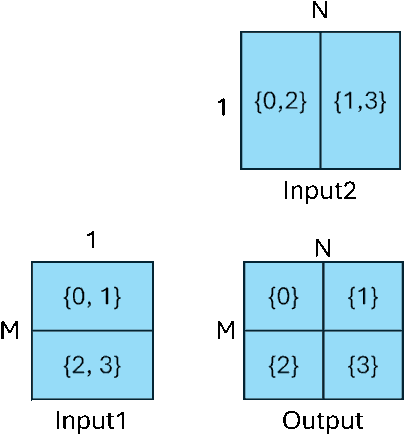

<!--
Copyright (c) ONNX Project Contributors

SPDX-License-Identifier: Apache-2.0
-->

# Sharding Formalism

In this section, we address the following aspects of a sharding specification:
the semantics of a sharding specification,
checking a sharding specification for validity,
and inferring a complete sharding specification given a partial one.

**Semantics of the sharding spec**:
We start with an informal description of the intended behavior of a sharding spec.
Operationally, the execution of an annotated node proceeds as below:
first, the input data is partitioned or repartitioned, as necessary, to
ensure that it is in the sharded form specified in the node.
This potentially involves communication operations among the different devices.
Next, a parallelized implementation of the operation is applied to the sharded
data.
Finally, the output is produced in the sharded form specified in the node.
This too may involve the use of communication collective ops.

**Validity of a sharding spec**:
Note that not all input sharding specs make sense.
For example, consider the addition operator `Add(A,B)`, where both inputs are
two dimensional tensors of shapes `[32, 1024]`. Sharding the first input between
two devices along axis 0 and the second input between the same two devices
along axis 1 does not make sense. In fact, we typically expect both inputs to be
sharded the same way. 

A sharding-checker to check if a given input sharding spec makes sense would be
useful and we recommend building one. The correctness requirements, however, vary from
operator to operator, though they mostly fall into one of a few different groups,
described in more detail below.

Note that the output sharding spec for a node does not have to be consistent with
the input sharding spec of the node.
This is useful when we want to reshard the output to be more suitable for the consumers
of the output.

However, even if a given sharding spec makes sense, a particular implementation
may not support it. The implementation should ideally provide feedback to
the user indicating this, but may choose to use an alternative impcccccbkvgevnrbllementation
or abort. Different users and scenarios may have different requirements (on
whether an alternative parallel or sequential implementation is preferable or not.)
Thus, a particular implementation may have stricter requirements on the set of sharding
specs that it supports.

**Inference of missing elements of a sharding spec**:
A validity checker can be extended to automatically infer some missing elements of a sharding
spec, as we outline below.

* If no input sharding spec is provided for a node's input X, it is assumed to be the same as
the sharding spec specified for X at the node that produces the value X.
* If X is a model input, then X is assumed to be unsharded.

If no output sharding spec is provided for a node's output, it is inferred from the node's
input sharding spec and the node's operation. In general, this may vary from operator to
operator. The inference scheme is outlined for a few core groups of operators below.

**Extensions**:
Currently, the sharding spec does not allow a way of specifying a sharding for the model
inputs. Sharded model inputs could be useful in an execution setting where the model input
already exists in sharded form, making it easier to compose sharded execution.
Extensions to the sharding spec to enable this is future work.

## Restrictions on Sharding Specs

Informally, constraints on sharding follow from parallelizability of the computation along
the different axes of the input and output tensors. Often the computation of the output
can be expressed in terms of loops (iterations) over the different axes of the input and/or output tensors.
If the iteration over a specific axis can be expressed as a parallel loop, sharding along
that axis makes sense. If that iteration is a reduction loop, sharding along that axis may
still work, but require a subsequent collective (multi-device) reduction after the local
reductions on each device.

### Unary elementwise ops

List of operations:
_Abs, Acos, Acosh, Asin, Asinh, Atan, Atanh, Cast, Ceil, Cos, Cosh, Dropout, Erf, Exp, Floor, Identity, IsInf, IsNaN, Log, Max, Min, Neg, Not, Reciprocal, Round, Sigmoid, Sign, Sin, Sinh, Tan, Tanh, ConstantOfShape_.

**Constraints on input sharding**
* No constraints on input sharding.

**Inference of output sharding**
* If not specified, the output sharding is the same as input sharding

### Broadcast n-ary elementwise ops

List of operations:
_Add, And, BitShift, BitwiseAnd, BitwiseNot, BitwiseOr, BitwiseXor, Equal, Greater, Less, Mod, Mul, Or, Pow, Sub, Sum, Where, Xor_.

**Constraints on input sharding**
* For any non-broadcast axis, the sharding spec of the two (or more) inputs must be identical
* Any broadcast axis of size 1 (in the unsharded original tensor) must be replicated across all devices
that participate in the parallel computation (that is, all devices identified in the node's sharding spec).
* The case where there are two or more broadcast axes is more involved. Some conditions must be satisfied
to ensure that the natural output (without extra communication ops) has a proper (complete) sharding.
The constraint is that the sharding specs of the multiple broadcast axes must be *composable*,
which is illustrated down below.

**Inference of output sharding**
* The sharding spec for any axis of the output is the same as the sharding spec for the corresponding
input axes in the case of non-broadcast.
* In the case of a single broadcast axis, the output axis derives the sharding spec from the corresponding
input axes with a size other than 1, if any.
* In the special case where all corresponding input axes have a size of 1, the output axis inherits
the same sharding (that is, replicated across all devices of the node op).
* In the case of two or more broadcast axes, the output axis derives the sharding spec from the corresponding
input axes with a size other than 1, if any. However, the device assignment is inferred by composing the
sharding specs of all broadcast axes (where each output shard resides in the intersection of the sets of
devices that contain the corresponding input shards used to compute that output shard). See below for
an illustration of this.

**Composing Sharding Specs on Different Axes**

Consider the example of an `Add (Input1, Input2)` op. Consider the case where `Input1` has shape `[M, 1]` and
`Input2` has shape `[1, N]`. The output has shape `[M, N]`, as a result of broadcasting.

The figure below shows how we can use sharding for both the `M` and `N` axes:



Note that in this example, both the `M` and `N` axes are split into two shards each.
This means that the output itself has 4 shards, as shown in the figure.
In this example, we want each output-shard to be on one device, as described by
the sharding spec
```
{
    device = [0, 1, 2, 3]
    sharded_dim =[
        {
            axis = 0
            simple_sharding =
            [
                {
                    num_shards = 2
                }
            ]
        }
        {
            axis = 1
            simple_sharding =
            [
                {
                    num_shards = 2
                }
            ]
        }
    ]
}
```
To produce this output, however, we need to ensure that the input-shards are
each available in two devices each, as shown in the figure above. In particular,
the first shard of `Input1` is needed by both devices 0 and 1, as it is used
to compute the first two output shards. Likewise, the first shard of `Input2`
is needed by both devices 0 and 2.

Thus, the sharding spec for `Input1` is as below:

```
{
    device = [-1, -2] // keys into device_map
    device_map = {-1: [0, 1], -2: [2, 3]}
    sharded_dim =[
        {
            axis = 0
            simple_sharding =
            [
                {
                    num_shards = 2
                }
            ]
        }
    ]
}
```
The sharding spec for `Input2` is analogous, as explained and shown in figure above.

This leads to the following constraint for input-sharding and inference rule
for output-sharding in the presence of two broadcast axes:
* The (inferred) devices for `output-shard[i,j]` is the intersection of the set of devices
for `input-1-shard[i]` and `input-2-shard[j]`. If this set is empty, then the input
sharding specs are not compatible (for broadcast composition).

This rule is extended to the case of more than two broadcast axes accordingly. 

### Reduction ops

**Constraints on input sharding**
* No constraints on input sharding.
* Sharding along non-reduction axes is straightforward. It indicates
parallelization of the iteration over the non-reduction axes.
* Sharding along reduction axes is permitted. It indicates parallelization of the reduction
loop, but this involves performing the reduction in two steps. In the first step, the
reduction is done locally on the shard, and in the second step the reduction is done
across the different shards. This can be typically mapped to a collective-reduce operation.

**Inference of output sharding**
* Non-reduction axes inherit the sharding of the corresponding axes of the input.
* Since the size of the reduction axis is one after the reduction, it can't be used
for any meaningful sharding. The axis may even be omitted from the output shape,
depending on the value of the attribute `keep_dims`. If the axis is retained, it
is treated as having no sharding.

In the case where the inputs are only sharded along one or more reduction axes,
there will be no sharded axis in the inferred output sharding specification.
However, there is still a choice as to whether the computed output is replicated
on all the devices that participate in this operation, or whether it is stored
only in some distinguished node. Collective-reduce operations typically
support both variations. The default inferred output specification is to
broadcast the computed result to all devices that participate in the particular
reduction (the first option).

### MatMul-like ops

List of operations: MatMul, Gemm, quantized variations of these ops, special cases of EinSum

The constraints for these ops follow analogous cases above. Consider the simple case of matrix multiplication
of two matrices of dimensions `[M, K]` and `[K, N]` producing an output matrix of dimension `[M, N]`.
This operation is essentially a broadcast-reduction operation, where the first
input is interpreted to have the shape `[M, K, 1]` and the second input is interpreted to have
the shape `[1, K, N]`, and we perform a broadcast element-wise multiplication, followed
by a reduce-sum along the `K` axis. The constraints and inference for the operation follows
from the corresponding rules for broadcast and reduction described above.

Axis 0 of the first input (with value `M`) is conceptually broadcast to the second input.
Hence, its constraints and handling are similar to the treatment of broadcast axes for n-ary
elementwise ops. Specifically, since only the first input has this axis, the partitioning of
this axis is not constrained by the partitioning of the second input. Furthermore, the output
matrix will inherit the partitioning for the corresponding axis from the partitioning of axis
0 of the first input.

Axis 1 of the second input (with value `N`) is also handled similarly.

The two axes with size value (the _reduction_ axes) are both required to
have the same sharding (similar to non-broadcast axes in a binary operation above).

The output device assignment follows the rules described above for broadcast axes.

### Unsupported ops

The following ops are not supported in this version:

* Operations on sequences and optional values.
* Control-flow ops, such as _If, Loop, Scan_.
* _GRU, LSTM, RNN, DFT, STFT, MelWeightMatrix, TfidVectorizer_
* Convolution / Pooling ops, such as:
* _AveragePool, GlobalAveragePool, GlobalLpPool, GlobalMaxPool, LpPool, MaxPool, MaxRoiPool,_
* _Conv, ConvInteger, ConvTranspose, DeformConv,_
* _InstanceNorm, LpNormalization, LayerNormalization_
