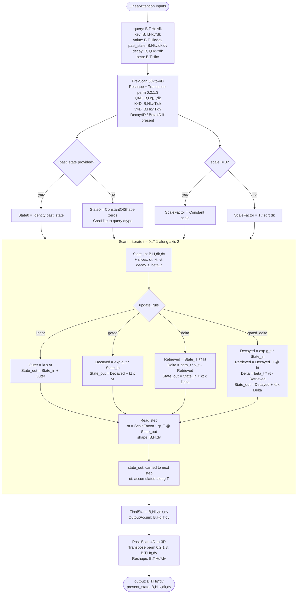

# Plan: LinearAttention Function Body Builder

## TL;DR

Implement `SetContextDependentFunctionBodyBuilder` for LinearAttention. The function decomposes the op into: 3D→4D reshape/transpose → ONNX Scan (sequential recurrent loop over T) → 4D→3D transpose/reshape. The Scan body graph implements one step of the recurrence (update_rule-dependent), and accumulates per-token outputs. Four build-time branches handle the update_rule variants.

## Background: How Linear Attention Works

### Core Idea
Unlike softmax attention (which computes pairwise scores between all tokens → O(n²)), linear attention maintains a **fixed-size state matrix** S of shape (d_k × d_v) per head. For each new token at position t:

1. **Read**: query the state to produce an output → o_t = scale · q_t^T · S_t  
2. **Write**: update the state with the new key-value pair → S_t = f(S_{t-1}, k_t, v_t, gates)

This is fundamentally a **recurrence** — each step depends on the previous state. The state acts as a "memory" that summarizes all past tokens in a compressed form.

### The Four Update Rules

All variants share: **o_t = scale · q_t^T · S_t** (read from state after update).

They differ in how S is updated:

| Rule | Update | What it means |
|------|--------|---------------|
| `linear` | S_t = S_{t-1} + k_t ⊗ v_t | Simple accumulation. State grows without bound. |
| `gated` | S_t = exp(g_t) · S_{t-1} + k_t ⊗ v_t | Exponential decay on old state before adding. g_t < 0 means forgetting. |
| `delta` | S_t = S_{t-1} + β_t · k_t ⊗ (v_t − S_{t-1}^T k_t) | Error-correction: retrieves what's stored, computes delta, writes correction. |
| `gated_delta` | S_t = exp(g_t) · S_{t-1} + β_t · k_t ⊗ (v_t − exp(g_t) · S_{t-1}^T k_t) | Combination of gating + delta rule. Used by Qwen3.5. |

Where:
- k_t ⊗ v_t = outer product → (d_k,) × (d_v,) → (d_k, d_v) matrix
- q_t^T · S_t = matrix-vector product → (d_k,) · (d_k, d_v) → (d_v,)
- exp(g_t) is the decay gate (0 < exp(g_t) ≤ 1 when g_t ≤ 0)
- β_t is the update rate (scalar per head)

### 3D ↔ 4D Packing

Inputs arrive as 3D `[B, T, H*D]` (heads packed into last dim). The op must:
1. Reshape to `[B, T, H, D]`
2. Transpose to `[B, H, T, D]` (so we can iterate over T)
3. Run the recurrence over T
4. Transpose result back to `[B, T, H, D]`
5. Reshape to `[B, T, H*D]`

## Why Scan?

The recurrence `S_t = f(S_{t-1}, ...)` is inherently sequential — each step needs the previous state. ONNX's `Scan` op is designed exactly for this: it iterates over a sequence axis, carries state variables forward, and accumulates outputs. This avoids needing to unroll the loop into T separate node chains (which would make the graph huge and T-dependent).

**Scan semantics:**
- **State inputs** (carried forward): the state matrix S → (B, H, d_k, d_v)  
- **Scan inputs** (one slice per iteration): q_t, k_t, v_t, [decay_t, beta_t] → sliced along T axis
- **State outputs**: updated S
- **Scan outputs** (accumulated): o_t → stacked along T axis to form (B, H, T, d_v)

## Steps

### Step 1: Static extraction and early-out

- Read `q_num_heads`, `kv_num_heads` (required attributes)
- Read `update_rule` attribute (default: "gated_delta")
- Read `scale` attribute (default: 0.0)
- Get input type for type propagation into the Scan body
- Return false if required info is unavailable

### Step 2: 3D → 4D reshaping (before Scan)

Using the FunctionBuilder:
```
# Query: (B, T, H_q*d_k) → (B, T, H_q, d_k) → (B, H_q, T, d_k)
QShape4D = Concat(B, T, H_q, NegOne)
QReshaped = Reshape(query, QShape4D)
Q4D = Transpose <perm=[0,2,1,3]> (QReshaped)

# Same for key, value (using kv_num_heads)
# Same for decay if present (using kv_num_heads)
# Beta: (B, T, H_kv) → (B, H_kv, T, 1) via reshape+transpose+unsqueeze
```

- **TODO(review):** GQA (q_num_heads > kv_num_heads) is not handled in the function body. The reference pseudocode doesn't show GQA expansion. For the reference decomposition, should we require q_num_heads == kv_num_heads, or expand K/V heads to match Q heads (like SDPA does)?

### Step 3: Initialize state

**If `ctx.hasInput(3)` (past_state provided):**
- `State = Identity(past_state)` — already (B, H_kv, d_k, d_v)

**Else:**
- Build a zero-initialized state:
  ```
  StateShape = Concat(B, H_kv, d_k_1D, d_v_1D)
  ZeroState = ConstantOfShape(StateShape)
  State = CastLike(ZeroState, query)
  ```

- **TODO(review):** State type should be S (potentially float32 even when T is float16). When past_state is absent, should zero state match T or default to float32?

### Step 4: Compute scale factor

```
if scale_attr != 0.0:
    ScaleFactor = Constant(scale)
else:
    d_k_float = Cast(d_k_1D, float)
    SqrtDk = Sqrt(d_k_float)
    ScaleFactor = Div(1.0, SqrtDk)
```

### Step 5: Build the Scan body graph

This is the core — a `GraphProto` that implements one recurrence step.

**Scan state inputs (carried):** `state_in` → (B, H, d_k, d_v)
**Scan sequence inputs (sliced along T=axis 2 of 4D):**
- `q_t` → (B, H, d_k)
- `k_t` → (B, H, d_k)
- `v_t` → (B, H, d_v)
- `decay_t` → (B, H, d_k) or (B, H, 1)  [if gated/gated_delta]
- `beta_t` → (B, H, 1) [if delta/gated_delta]

**Body computation (gated_delta shown):**
```
# 1. Apply decay: state = exp(g_t) * state
DecayExp = Exp(decay_t)                          # (B, H, d_k)
DecayExpUnsqueeze = Unsqueeze(DecayExp, -1)       # (B, H, d_k, 1)
DecayedState = Mul(state_in, DecayExpUnsqueeze)   # (B, H, d_k, d_v)

# 2. Retrieve from memory: retrieved = S^T @ k_t
KtUnsqueeze = Unsqueeze(k_t, -1)                 # (B, H, d_k, 1)
Retrieved = MatMul(Transpose(DecayedState), KtUnsqueeze)  # (B, H, d_v, 1)
RetrievedSqueeze = Squeeze(Retrieved, -1)         # (B, H, d_v)

# 3. Error correction: delta = beta_t * (v_t - retrieved)
Diff = Sub(v_t, RetrievedSqueeze)                 # (B, H, d_v)
BetaUnsqueeze = Unsqueeze(beta_t, -1)             # (B, H, 1) already broadcastable
Delta = Mul(BetaUnsqueeze, Diff)                  # (B, H, d_v)

# 4. Write to memory: state = decayed_state + k_t ⊗ delta
DeltaUnsqueeze = Unsqueeze(Delta, -2)             # (B, H, 1, d_v)
OuterProduct = MatMul(KtUnsqueeze, DeltaUnsqueeze)  # (B, H, d_k, d_v)
state_out = Add(DecayedState, OuterProduct)       # (B, H, d_k, d_v)

# 5. Query: o_t = scale * q_t^T @ state
QtUnsqueeze = Unsqueeze(q_t, -2)                  # (B, H, 1, d_k)
QueryResult = MatMul(QtUnsqueeze, state_out)      # (B, H, 1, d_v)
QuerySqueeze = Squeeze(QueryResult, -2)           # (B, H, d_v)
output_t = Mul(ScaleFactor, QuerySqueeze)         # (B, H, d_v)
```

**Scan outputs:**
- **State output (carried):** `state_out` → (B, H, d_k, d_v) — goes to next iteration
- **Scan output (accumulated):** `output_t` → (B, H, d_v) — stacked to form (B, H, T, d_v)

**Build-time branches by update_rule:**
- `linear`: skip decay (no Exp/Mul on state), skip beta/retrieval (direct outer product k⊗v)
- `gated`: include decay, skip beta/retrieval (direct outer product k⊗v)
- `delta`: skip decay, include beta/retrieval/delta
- `gated_delta`: include both decay and beta/retrieval/delta

### Step 6: Construct the Scan node

```
Scan <body=scan_body_graph, num_scan_inputs=N, scan_input_axes=[2,2,2,...]> 
    (State, Q4D, K4D, V4D, [Decay4D, Beta4D])
    => (FinalState, OutputAccum)
```

- `num_scan_inputs`: 3 (q,k,v) + 0/1/1/2 depending on update_rule
- `scan_input_axes`: all `2` (scanning along T axis in (B,H,T,D))
- `scan_output_axes`: `[2]` (accumulate along T axis)

### Step 7: 4D → 3D reshaping (after Scan)

```
# OutputAccum: (B, H_q, T, d_v)
OutputTranspose = Transpose <perm=[0,2,1,3]> (OutputAccum)  # (B, T, H_q, d_v)
OutputShape3D = Concat(B, T, NegOne)
output = Reshape(OutputTranspose, OutputShape3D)             # (B, T, H_q*d_v)

present_state = Identity(FinalState)                         # (B, H_kv, d_k, d_v)
```

### Step 8: Finalize

```
schema.BuildFunction(functionProto);
return true;
```

## Build-time branches summary

| Condition | Check | Affects |
|-----------|-------|---------|
| update_rule | `ctx.getAttribute("update_rule")` | Steps 5-6: Scan body nodes, number of scan inputs |
| past_state provided | `ctx.hasInput(3)` | Step 3: Identity vs zero-init |
| scale override | `ctx.getAttribute("scale")` | Step 4: constant vs 1/sqrt(d_k) |
| decay present | update_rule ∈ {gated, gated_delta} | Steps 2, 5-6: include decay in reshape + Scan |
| beta present | update_rule ∈ {delta, gated_delta} | Steps 2, 5-6: include beta in reshape + Scan |

## Complexity Assessment

This is significantly more complex than CausalConvWithState because:
1. We must build a `GraphProto` for the Scan body (manual NodeProto/ValueInfoProto construction)
2. The Scan body varies by update_rule (4 variants)
3. Multiple reshape/transpose steps for 3D↔4D conversion
4. GQA (q_num_heads ≠ kv_num_heads) may need head expansion

## Open Questions / TODOs

1. **TODO: GQA support** — Should the function body handle q_num_heads ≠ kv_num_heads? If yes, need K/V head expansion (like SDPA). If no, return false when they differ.
2. **TODO: State dtype** — When past_state is absent, should zero state be type T or float32? Proposal says S can differ from T.
3. **TODO: Scan body GraphProto construction** — Must be built manually with NodeProto/ValueInfoProto (no FunctionBuilder for subgraphs). Follow SequenceMap's pattern.
4. **TODO: Decay broadcasting** — decay can be (B,T,H_kv) [per-head scalar] or (B,T,H_kv*d_k) [per-key-dim]. After 4D reshape, these become (B,H,T,1) vs (B,H,T,d_k). The Scan body's Unsqueeze+Mul must handle both.
5. **TODO: Scale as graph input** — ScaleFactor computed outside Scan needs to be available inside. It can be passed as a constant node inside the body graph, or as an additional Scan state (unchanged each step).

## Relevant files

- `onnx/defs/nn/defs.cc` — Add builder after the TypeAndShapeInferenceFunction (~line 4219), before the closing `));`
- `onnx/defs/sequence/defs.cc` (~line 460-600) — SequenceMap's Loop body builder as pattern reference for GraphProto construction
- `onnx/defs/controlflow/defs.cc` (~line 126) — Scan op schema for understanding inputs/outputs/axes

## Diagram

